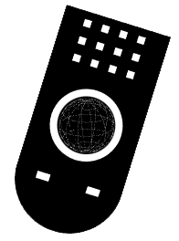
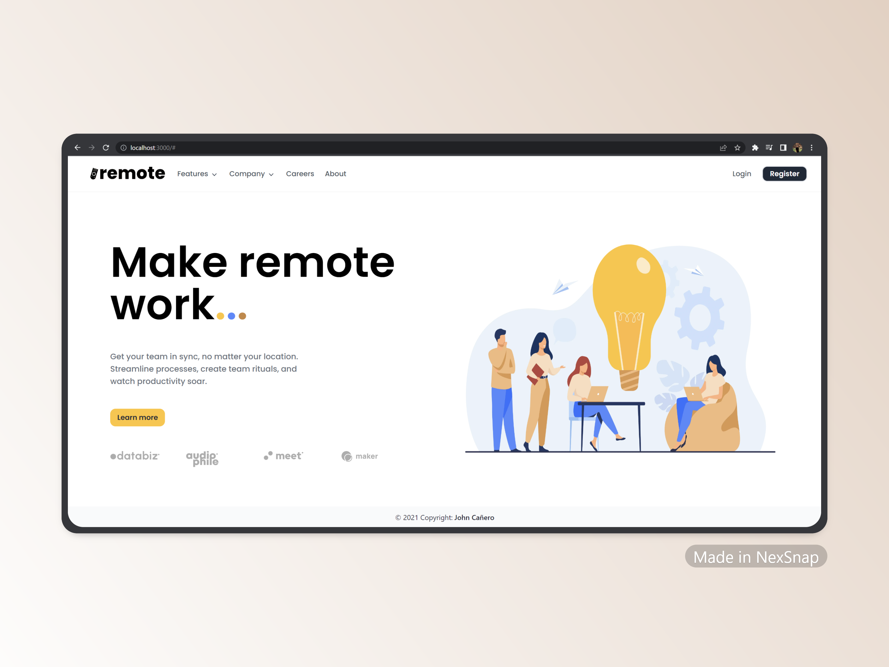
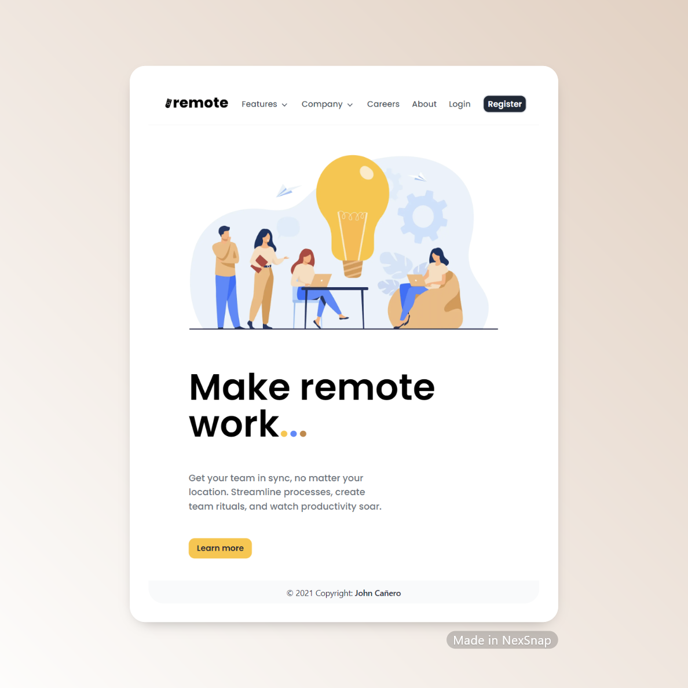
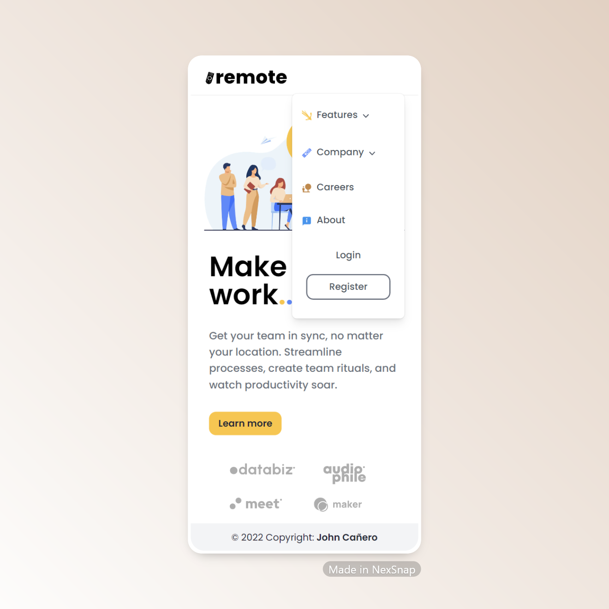
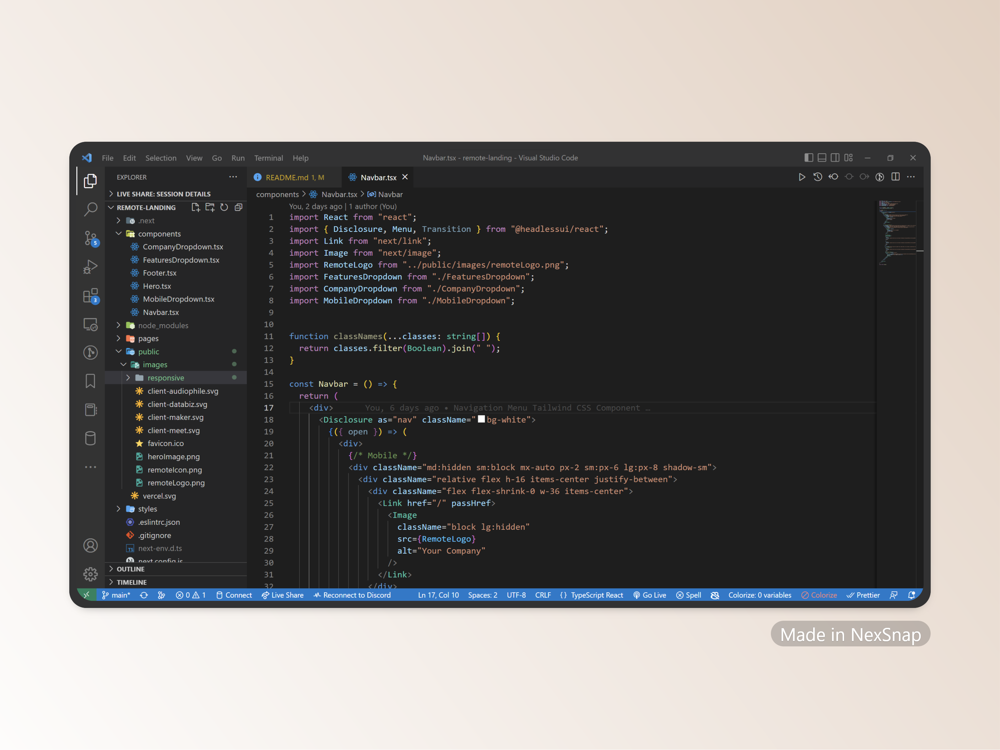

<!-- markdownlint-configure-file {
  "MD013": {
    "code_blocks": false,
    "tables": false
  },
  "MD033": false,
  "MD041": false
} -->

  

# Remote Landing Page

This is the Remote Landing Page made by Next Js, Typescript and Tailwind CSS.

A Hero Section Feature: A Modified Challenge from Frontend Mentor.

## Website

🖥️ [https://remote-landing-page-by-johncanero.vercel.app/]

✍️ Project by John Cañero

## Responsive Design

🪟: [Desktop - Tablet - Mobile]

